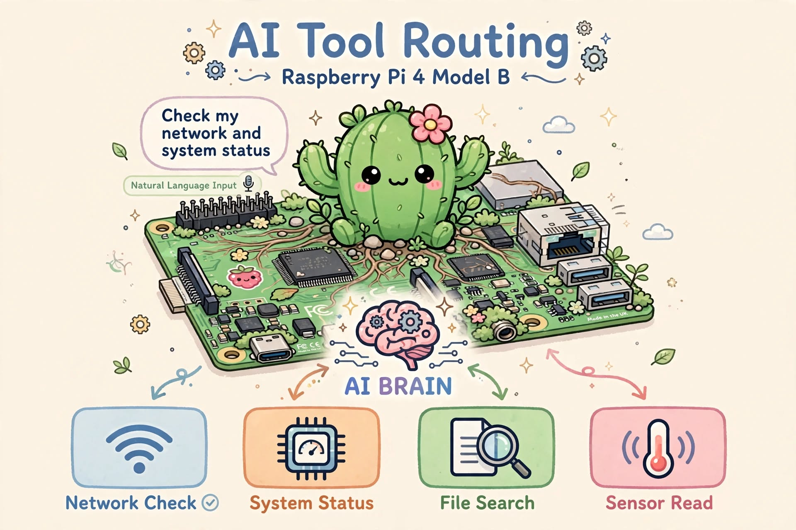

# Raspberry Pi Tool Routing Benchmark

<p align="center">
  
</p>

---

A Raspberry Pi 4 project comparing three approaches for converting
natural-language hardware/system requests into **exact structured tool calls**:

1. **Keyword-only deterministic matching**
2. **Needle 2** — Base Needle and LoRA fine-tuned models
3. **General tiny LLMs through llama.cpp** — 7 models × 4 tool-call formats

The project asks a practical edge-AI question:

> For a constrained Raspberry Pi agent, when is a tiny LLM useful, and when is
> deterministic routing faster, smaller, and more reliable?

---

## Key result: 7 tiny LLMs × 4 output formats

Before the final 320-case benchmark, all seven GGUF models were screened on the
same 30 routing cases using **JSON, YAML, XML, and natural/plain-text output
formats**.

The numbers below are **strict exact-routing accuracy**: the model must produce
the correct tool and exact arguments in a machine-usable output.

| Model                           | JSON   | YAML   | XML   | Natural   | Best            |
|:--------------------------------|:-------|:-------|:------|:----------|:----------------|
| Llama-3.2-1B-Instruct-Q4_K_M    | 46.7%  | 53.3%  | 36.7% | 30.0%     | YAML (53.3%)    |
| Qwen3.5-0.8B-Q4_K_M             | 70.0%  | 86.7%  | 0.0%  | 66.7%     | YAML (86.7%)    |
| qwen3-0.6b-Q4_K_M               | 83.3%  | 80.0%  | 0.0%  | 53.3%     | JSON (83.3%)    |
| SmolLM2-360M-Instruct-Q4_K_M    | 10.0%  | 0.0%   | 6.7%  | 13.3%     | NATURAL (13.3%) |
| gemma-3-270m-it-Q4_K_M          | 6.7%   | 0.0%   | 0.0%  | 3.3%      | JSON (6.7%)     |
| SmolLM2-135M-Instruct-Q4_K_M    | 0.0%   | 3.3%   | 0.0%  | 0.0%      | YAML (3.3%)     |
| tinyllama-1.1b-chat-v1.0.Q4_K_M | 0.0%   | 10.0%  | 0.0%  | 3.3%      | YAML (10.0%)    |

Two findings were especially important:

- **Qwen3 0.6B + JSON** and **Qwen3.5 0.8B + YAML** were clearly stronger than
  the other five general tiny LLMs.
- Output representation matters substantially even when the model and test cases
  are unchanged.

> **XML note:** the strict XML scores for Qwen3/Qwen3.5 are artificially harsh
> as a measure of semantic routing ability. During analysis, these models often
> predicted the correct tool/arguments but violated the requested XML wrapper or
> closing-tag structure. The table intentionally preserves the original strict
> machine-usable benchmark score rather than repairing model output afterward.

The full screening data is stored in:

```text
results/llama_cpp/screening_30/screen30_model_format_summary.csv
```

---

## Seven general-purpose tiny LLMs tested

| Model file                           | Family    | Parameters   | Quantization   | GGUF size   | Best 30-case format   |
|:-------------------------------------|:----------|:-------------|:---------------|:------------|:----------------------|
| Llama-3.2-1B-Instruct-Q4_K_M.gguf    | Llama 3.2 | 1B           | Q4_K_M         | 770.3 MB    | YAML                  |
| Qwen3.5-0.8B-Q4_K_M.gguf             | Qwen3.5   | 0.8B         | Q4_K_M         | 507.8 MB    | YAML                  |
| qwen3-0.6b-Q4_K_M.gguf               | Qwen3     | 0.6B         | Q4_K_M         | 461.8 MB    | JSON                  |
| SmolLM2-360M-Instruct-Q4_K_M.gguf    | SmolLM2   | 360M         | Q4_K_M         | 258.1 MB    | NATURAL               |
| gemma-3-270m-it-Q4_K_M.gguf          | Gemma 3   | 270M         | Q4_K_M         | 241.4 MB    | JSON                  |
| SmolLM2-135M-Instruct-Q4_K_M.gguf    | SmolLM2   | 135M         | Q4_K_M         | 100.6 MB    | YAML                  |
| tinyllama-1.1b-chat-v1.0.Q4_K_M.gguf | TinyLlama | 1.1B         | Q4_K_M         | 637.8 MB    | YAML                  |

The parameter counts above are the nominal sizes indicated by the model names.
The **GGUF size** column is the actual file size recorded during our Raspberry Pi
screening run.

The GGUF binaries themselves are not redistributed by this repository. Obtain
them from their original model distributions and place them in the configured
model directory.

---

## Final 320-case comparison

| Method | Routing exact | Format | Median latency | Runtime model / artifact size |
|---|---:|---|---:|---:|
| **Keyword-only** | **96.56%** | rules | **<1 s \*** | **~16 KB method folder (<0.1 MB)** |
| **Qwen3 0.6B** | **86.88%** | JSON | 7.095 s | **461.8 MB GGUF** |
| **Qwen3.5 0.8B** | **85.62%** | YAML | 5.815 s | **507.8 MB GGUF** |
| **Needle FT08 ep3** | **67.81%** | native tool call | 2.199 s | **13.1 MB `.cact`** |
| **Base Needle** | **47.50%** | native tool call | 2.221 s | **13.1 MB `.cact`** |

\*The original Keyword-only 320-case CSV did not record per-query latency. The
router is deterministic and expected to be comfortably sub-second on the Pi,
but this entry should be replaced with a measured median if timing is added to a
future rerun.


The canonical final table is stored at:

```text
results/final_comparison/final_method_comparison.csv
```

---

## Repository structure

```text
raspberry_pi_tool_routing/
├── README.md
├── requirements.txt
├── benchmarks/
│   ├── format_pilot_20.jsonl
│   ├── screening_30.jsonl
│   ├── final_320.jsonl
│   └── needle_v1_500.jsonl
├── configs/
│   ├── capabilities.example.json
│   ├── needle_models.json
│   └── llamacpp_models.json
├── shared/
│   ├── tool_spec.py
│   ├── cases.py
│   ├── scoring.py
│   ├── policy.py
│   └── executors.py
├── methods/
│   ├── keyword/
│   │   ├── router.py
│   │   ├── runtime.py
│   │   └── benchmark.py
│   ├── needle/
│   │   ├── tools_revB.py
│   │   ├── runtime.py
│   │   ├── benchmark.py
│   │   └── training/
│   │       ├── build_rpi_dataset_v2_1.py
│   │       └── README.md
│   └── llama_cpp/
│       ├── formats.py
│       ├── backend.py
│       ├── server.py
│       ├── runtime.py
│       └── benchmark.py
├── models/
│   ├── needle/
│   └── llama_cpp/
├── results/
│   ├── final_comparison/
│   ├── keyword/
│   ├── needle/
│   │   ├── final_320/
│   │   ├── history_500/
│   │   ├── analysis/
│   │   └── training_logs/
│   └── llama_cpp/
│       ├── format_pilot_20/
│       ├── screening_30/
│       └── final_320/
├── scripts/
│   ├── validate_project.py
│   └── summarize_results.py
└── docs/
    ├── methodology.md
    └── experiment_history.md
```

Intermediate broken packages, duplicate READMEs, temporary parser experiments,
and obsolete standalone project copies are intentionally excluded.

---

# 1. Common tool set

All routing approaches target the same 23 tools.

### GPIO
- `set_gpio(pin, state)`
- `read_gpio(pin)`

### I2C
- `scan_i2c_bus(bus)`
- `check_i2c_device(bus, address)`
- `dump_i2c_device(bus, address)`
- `get_i2c_status()`

### SPI / UART / USB
- `get_spi_status()`
- `list_spi_devices()`
- `get_uart_status()`
- `list_serial_ports()`
- `list_usb_devices()`
- `get_usb_topology()`

### Camera / display
- `get_hdmi_status(connector)`
- `list_displays()`
- `list_cameras()`
- `get_camera_status()`

### Pi/Linux status
- `get_temperature()`
- `get_throttling_status()`
- `get_cpu_frequency()`
- `get_network_status()`
- `get_system_status()`
- `get_disk_usage()`
- `restart_service(service)`

The headline scoring rule is strict:

```text
PASS =
correct tool
AND
exact arguments
```

---

# 2. Installation

The project was developed for Raspberry Pi OS / Debian on a 64-bit Raspberry Pi
4. Python 3.9+ is required by current Needle releases.

## 2.1 System packages

```bash
sudo apt update
sudo apt install -y \
  git \
  build-essential \
  cmake \
  python3 \
  python3-venv \
  python3-pip
```

Create the project environment:

```bash
git clone <your-repository-url>
cd raspberry_pi_tool_routing

python3 -m venv .venv
source .venv/bin/activate

python -m pip install --upgrade pip
pip install -r requirements.txt
```

## 2.2 Install Needle 2

### Option A — install the published package

Inside the activated virtual environment:

```bash
pip install cactus-needle
needle --help
```

The Needle runtime can fetch its engine automatically on first use. To download
the engine explicitly before going offline:

```bash
needle fetch
```

### Option B — install Needle from source

This is useful when reproducing the exact source-based development workflow:

```bash
cd /home/pi4
git clone https://github.com/cactus-compute/needle.git
cd needle

python3 -m venv .venv
source .venv/bin/activate

python -m pip install --upgrade pip
pip install -e .

needle --help
```

For strict experiment reproduction, use the same Needle version/commit recorded
for your benchmark environment rather than silently moving to a newer release.

Return to this project and reactivate whichever Needle environment you intend to
use before running `methods.needle.*`.

## 2.3 Install and build llama.cpp

On Raspberry Pi, building the CPU version from source is straightforward:

```bash
cd /home/pi4

git clone https://github.com/ggml-org/llama.cpp.git
cd llama.cpp

cmake -B build -DCMAKE_BUILD_TYPE=Release
cmake --build build --config Release -j 2
```

`-j 2` is a conservative compile setting for a low-memory Raspberry Pi. A Pi
with more RAM can use a larger parallel build value.

Verify the server binary:

```bash
./build/bin/llama-server --help | head
```

The benchmark scripts default to:

```text
/home/pi4/LLM_Test/llama.cpp/build/bin/llama-server
```

If your clone is elsewhere, either place it at that path or pass `--server-bin`
to the llama.cpp benchmark/runtime scripts.

## 2.4 Validate this repository

```bash
cd /home/pi4/raspberry_pi_tool_routing
source .venv/bin/activate

python scripts/validate_project.py
```

Review archived benchmark summaries:

```bash
python scripts/summarize_results.py
```

---


# 3. Method A — Keyword-only routing

Run one query:

```bash
python -m methods.keyword.runtime \
  --query "Set GPIO 17 high"
```

Nothing is executed unless `--execute` is explicitly supplied.

Re-run the 320 benchmark:

```bash
python -m methods.keyword.benchmark \
  --cases benchmarks/final_320.jsonl \
  --out results/keyword/final_320/keyword_results_new.csv
```

---

# 4. Method B — Needle

Place the tuned `.cact` model in:

```text
models/needle/
```

Base Needle:

```bash
python -m methods.needle.runtime \
  --query "Show network status"
```

Fine-tuned Needle:

```bash
python -m methods.needle.runtime \
  --weights models/needle/needle_rpi_ft08_ep3.cact \
  --query "Turn GPIO 17 on"
```

Run Base + selected fine-tunes:

```bash
python -m methods.needle.benchmark \
  --cases benchmarks/final_320.jsonl \
  --weights \
    models/needle/needle2_base.cact \
    models/needle/needle_rpi_ft08_ep3.cact
```

Run all locally available Needle `.cact` files:

```bash
python -m methods.needle.benchmark \
  --cases benchmarks/final_320.jsonl \
  --weights models/needle/*.cact
```

Historical FT01–FT12 benchmark and training evidence is kept under:

```text
results/needle/history_500/
results/needle/training_logs/
```

---

# 5. Method C — llama.cpp tiny LLMs

Use `--server-bin` to point the project to the `llama-server` binary from your
llama.cpp build. For example:

```text
/home/pi4/LLM_Test/llama.cpp/build/bin/llama-server
```

If you built llama.cpp somewhere else, replace that path in the commands below.

Run one model:

```bash
python -m methods.llama_cpp.runtime \
  --server-bin /home/pi4/LLM_Test/llama.cpp/build/bin/llama-server \
  --model /home/pi4/LLM_Test/models/qwen3-0.6b-Q4_K_M.gguf \
  --format json \
  --query "Set GPIO 17 high"
```

## Re-run the 20-case format pilot

```bash
python -m methods.llama_cpp.benchmark \
  --server-bin /home/pi4/LLM_Test/llama.cpp/build/bin/llama-server \
  --cases benchmarks/format_pilot_20.jsonl \
  --models-dir /home/pi4/LLM_Test/models \
  --formats json yaml xml natural \
  --out-dir results/llama_cpp/new_pilot20
```

## Re-run the 30-case screen for all seven models

```bash
python -m methods.llama_cpp.benchmark \
  --server-bin /home/pi4/LLM_Test/llama.cpp/build/bin/llama-server \
  --cases benchmarks/screening_30.jsonl \
  --models-dir /home/pi4/LLM_Test/models \
  --formats json yaml xml natural \
  --out-dir results/llama_cpp/new_screen30
```

The screening stage selected:

```text
Qwen3 0.6B   -> JSON
Qwen3.5 0.8B -> YAML
```

## Re-run the final 320 Qwen tests

```bash
python -m methods.llama_cpp.benchmark \
  --server-bin /home/pi4/LLM_Test/llama.cpp/build/bin/llama-server \
  --cases benchmarks/final_320.jsonl \
  --models qwen3-0.6b-Q4_K_M.gguf \
  --formats json \
  --out-dir results/llama_cpp/final_320
```

```bash
python -m methods.llama_cpp.benchmark \
  --server-bin /home/pi4/LLM_Test/llama.cpp/build/bin/llama-server \
  --cases benchmarks/final_320.jsonl \
  --models Qwen3.5-0.8B-Q4_K_M.gguf \
  --formats yaml \
  --out-dir results/llama_cpp/final_320
```

The completed final summary is stored at:

```text
results/llama_cpp/final_320/final320_qwen_summary.csv
```

---

# 6. Benchmark datasets

### `format_pilot_20.jsonl`
Controlled format experiment for JSON/YAML/XML/natural output.

### `screening_30.jsonl`
Seven-model screening benchmark with broader GPIO and non-GPIO coverage.

### `final_320.jsonl`
Canonical final benchmark shared across all three routing families.

### `needle_v1_500.jsonl`
Historical Needle development benchmark retained for reproducibility of the
schema/fine-tuning experiments.

---

# 7. Result archive

### Final cross-method comparison

```text
results/final_comparison/final_method_comparison.csv
results/final_comparison/final_method_comparison.md
```

### Keyword

```text
results/keyword/final_320/
```

### Needle

```text
results/needle/final_320/
results/needle/history_500/
results/needle/analysis/
results/needle/training_logs/
```

### llama.cpp

```text
results/llama_cpp/format_pilot_20/
results/llama_cpp/screening_30/
results/llama_cpp/final_320/
```

---

# 8. Safety and real execution

Routing accuracy is **not** treated as authorization.

```text
Natural language
      |
      v
Routing method
      |
      v
Structured tool proposal
      |
      v
Deterministic policy
      |
      v
Fixed executor
```

Runtime scripts are dry-run by default. GPIO writes, I2C dumps, and service
restarts should only run when execution is explicitly requested.

---

# 9. Reproducing the experiment

```text
1. Run Keyword-only on final_320.jsonl.
2. Run Base Needle and the Needle fine-tune sweep.
3. Run all 7 GGUF models × JSON/YAML/XML/natural on format_pilot_20.
4. Run all 7 models × all 4 formats on screening_30.
5. Select Qwen3/JSON and Qwen3.5/YAML.
6. Run the two finalists on final_320.
7. Compare routing exact accuracy and Raspberry Pi efficiency.
```

# 10. Needle Fine-tune model

The best fine-tuned Needle model used in the final benchmark is available from
the project's GitHub Releases:

- `needle_rpi_ft08_ep3.cact` — deployable Raspberry Pi model
- `needle_rpi_ft08_ep3.pkl` — optional training checkpoint

Download the `.cact` file and place it in:

```text
models/needle/